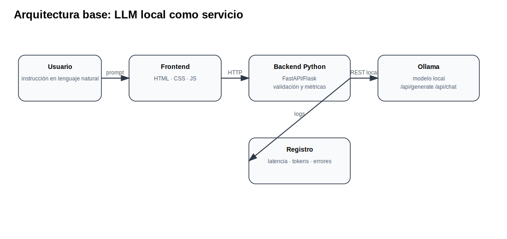

# Prospectiva Tecnológica: IA con LLM para Automatización y Robótica

Este sitio concentra el material de clase, guías de práctica, código base, referencias académicas y lineamientos del proyecto integrador para el curso intensivo de **Prospectiva Tecnológica** con enfoque en **IA generativa, modelos de lenguaje, agentes y automatización/robótica**.

<h3>Propósito del curso</h3>
El curso vincula la prospectiva tecnológica con el diseño de prototipos funcionales. El eje práctico es construir, medir y documentar sistemas donde un LLM interpreta instrucciones humanas y participa en una arquitectura de automatización o robótica mediante APIs, MQTT, WebSocket, visión, sensores, actuadores o simuladores.

## Cómo usar este repositorio

1. Revisar el [cronograma](cronograma.md) para ubicar cada sesión.
2. Usar las páginas de [temas](temas/index.md) como material de explicación del profesor.
3. Seguir las guías de [sesiones](sesiones/index.md) durante cada clase.
4. Documentar prácticas con el formato tipo FabAcademy descrito en [guía de documentación](recursos/documentacion-fabacademy.md).
5. Desarrollar el [proyecto final](proyecto/index.md) con checkpoints semanales.

## Arquitectura general del curso

## Entregables principales

- Repositorio personal o por equipo con bitácora de prácticas.
- Benchmarks de modelos y recursos de cómputo.
- Chatbot local con frontend/backend.
- Integración LLM → salida estructurada → comunicación → actuador/simulador.
- Agente con skills, validadores y retroalimentación.
- Proyecto final con análisis prospectivo, demo, reporte y video.

## Fuentes base

El curso parte de literatura y documentación formal: el artículo de Transformers de Vaswani et al. (2017), documentación de Hugging Face, Ollama, estándares MQTT de OASIS, documentación de WebSocket de MDN, FastAPI, APIs comerciales y trabajos de robótica como RT-2, PaLM-E y SayCan.
