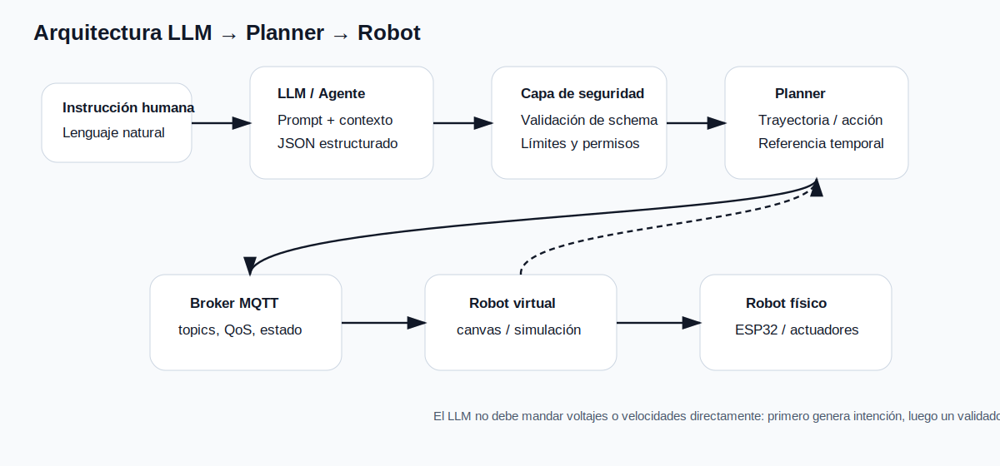

# Prospectiva tecnológica e IA generativa aplicada a robótica

## 1. Propósito del módulo

La prospectiva tecnológica no consiste en “adivinar” el futuro. Su objetivo es construir marcos de análisis para reducir incertidumbre, comparar trayectorias tecnológicas y tomar decisiones informadas sobre inversión, adopción, investigación y diseño. En este curso, el objeto de estudio es el uso de IA generativa y LLM en automatización y robótica.

El punto central es observar una transición: los sistemas robóticos tradicionales se programan mediante reglas, controladores, trayectorias y estados definidos explícitamente; los sistemas robóticos mediados por LLM incorporan una capa semántica capaz de traducir instrucciones humanas en planes, comandos o herramientas. Esta transición abre posibilidades, pero también introduce riesgos: alucinaciones, latencia, costo, dependencia de proveedores, incertidumbre de salida y problemas de seguridad.

## 2. De la prospectiva clásica a la prospectiva técnico-experimental

Para analizar una tecnología emergente se recomienda separar cuatro niveles:

| Nivel | Pregunta | Evidencia esperada |
|---|---|---|
| Tendencia | ¿Qué está cambiando? | Papers, reportes técnicos, documentación de proveedores, benchmarks. |
| Capacidad | ¿Qué puede hacer hoy? | Prototipos, pruebas locales, métricas de desempeño. |
| Restricción | ¿Qué impide su adopción? | Costo, latencia, seguridad, disponibilidad de hardware, regulación. |
| Escenario | ¿Qué podría pasar en 2–5 años? | Matriz de escenarios, señales débiles, casos de uso. |

En robótica, una tecnología no se evalúa sólo por la calidad lingüística de la respuesta. Se evalúa por su capacidad de conectarse a un flujo de percepción-decisión-acción. Por ejemplo, un LLM puede “entender” que el usuario pide “ve al centro”, pero el sistema completo debe validar coordenadas, límites físicos, control de velocidad, estado del robot, conectividad y paro seguro.

## 3. ¿Por qué los LLM importan para automatización?

Los LLM permiten tres capacidades útiles para sistemas de automatización:

1. **Interfaz semántica:** traducir lenguaje natural a instrucciones estructuradas.
2. **Planeación simbólica:** descomponer una meta en pasos de alto nivel.
3. **Orquestación de herramientas:** llamar APIs, scripts, sensores o actuadores mediante funciones definidas.

Sin embargo, estas capacidades no son control automático. Un LLM no reemplaza un PID, un planner cinemático, una máquina de estados segura o un PLC. La arquitectura académicamente defendible es híbrida: el LLM propone, pero los módulos deterministas validan y ejecutan.

## 4. Caso guía del curso

Trabajaremos con el siguiente caso general:

```text
Un usuario da una instrucción en lenguaje natural.
Un LLM la convierte en un JSON con intención, parámetros y restricciones.
Un backend valida el JSON.
Un planner genera referencias o acciones.
Una capa de comunicación envía mensajes por MQTT/WebSocket.
Un robot virtual, embebido o físico ejecuta la acción.
El sistema mide latencia, éxito, error y seguridad.
```

{: .diagram }

## 5. Actividad de discusión en clase

Formar equipos de 3 personas y elegir un sistema robótico o de automatización. Para ese sistema, responder:

- ¿Qué parte se beneficiaría de lenguaje natural?
- ¿Qué parte debe permanecer determinista?
- ¿Qué falla sería crítica si el LLM se equivoca?
- ¿Qué métrica demostraría que el LLM aporta valor?

{: .evidencia }
> Evidencia mínima: diagrama de arquitectura, lista de riesgos, hipótesis de valor y una métrica cuantitativa.

## 6. Lecturas y fuentes

- National Academies. *Persistent Forecasting of Disruptive Technologies*. <https://nap.nationalacademies.org/catalog/12557/persistent-forecasting-of-disruptive-technologies>
- NIST. *AI Risk Management Framework*. <https://www.nist.gov/itl/ai-risk-management-framework>
- Vaswani et al. *Attention Is All You Need*. <https://arxiv.org/abs/1706.03762>
- Ahn et al. *Do As I Can, Not As I Say*. <https://arxiv.org/abs/2204.01691>
