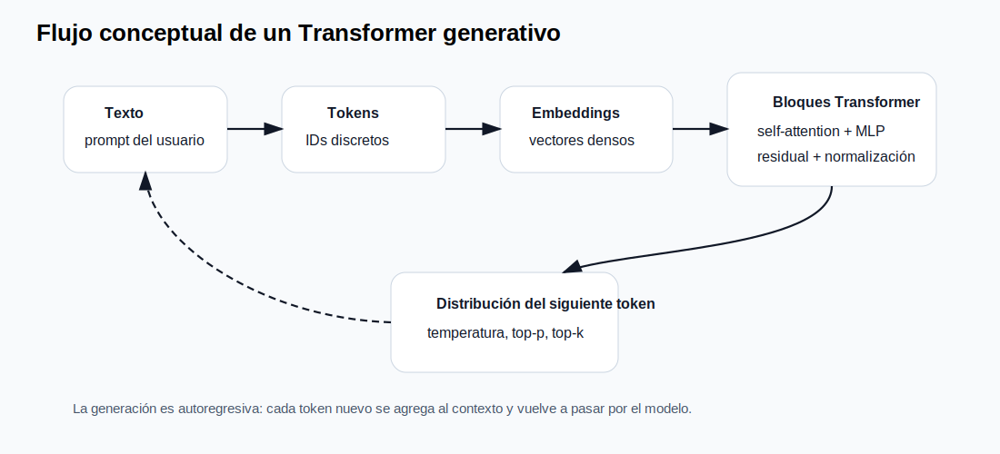

# Transformers, tokens y modelos de lenguaje

## 1. Pregunta central

¿Qué ocurre técnicamente cuando un usuario escribe una instrucción como “traza un círculo de radio 100 mm en 60 segundos”? Para construir sistemas confiables hay que entender el flujo interno de un LLM: tokenización, embeddings, atención, predicción de siguiente token, muestreo, contexto y salida.

## 2. El salto del Transformer

El artículo *Attention Is All You Need* propuso una arquitectura basada en mecanismos de atención, eliminando recurrencia y convoluciones como componente central para secuencias. La idea clave es que cada token puede ponderar la relevancia de otros tokens del contexto. En robótica, esta característica permite relacionar partes separadas de una instrucción: “círculo”, “radio 100”, “centro en 10,300”, “1 vuelta” y “60 s”.

{: .diagram }

## 3. Tokenización

Un token no siempre equivale a una palabra. Puede ser una palabra completa, una subpalabra, un signo o fragmentos de texto. Esta diferencia importa porque los costos y límites de contexto se calculan en tokens, no en caracteres ni palabras.

Ejemplo conceptual:

```text
Prompt: "Mueve el robot al centro y detente"
Tokens aproximados: ["Mueve", " el", " robot", " al", " centro", " y", " det", "ente"]
```

En un sistema de automatización, el conteo de tokens se vuelve una variable de ingeniería: afecta latencia, costo, consumo de memoria y estabilidad de la respuesta. Un prompt de sistema excesivamente largo puede mejorar el control de formato, pero aumentar tiempo y costo.

## 4. Parámetros, pesos y tamaño del modelo

Cuando se dice que un modelo tiene 7B, 8B, 70B o 405B parámetros se habla del número de pesos aprendidos durante entrenamiento. Más parámetros suelen aumentar capacidad, pero también requieren más memoria y cómputo. No hay que confundir:

- **Parámetros:** tamaño interno del modelo.
- **Tokens de contexto:** longitud máxima de entrada y salida que puede manejar.
- **Cuantización:** representación reducida de pesos, por ejemplo Q4 o Q8, para ejecutar modelos grandes en hardware limitado.
- **Temperatura:** parámetro de muestreo que modifica la aleatoriedad de la salida.

## 5. Inferencia autoregresiva

Los LLM generativos producen texto token por token. Para generar una respuesta, el modelo calcula una distribución de probabilidad sobre el siguiente token. Después selecciona uno, lo agrega al contexto y repite. Por eso la salida larga tarda más que la salida corta.

```text
Entrada: "Devuelve JSON para mover robot al centro"
Paso 1: predice "{"
Paso 2: predice ""intent""
Paso 3: predice ":"
...
```

Esta naturaleza autoregresiva explica por qué un LLM puede fallar en formato JSON: no “construye” un objeto con garantías formales; predice texto. Por eso se usan validadores, esquemas y reintentos.

## 6. Ejemplo académico: salida estructurada

Prompt recomendado para automatización:

```text
Eres un intérprete de instrucciones para un robot móvil.
Responde sólo JSON válido. No agregues explicación.
Formato:
{"intent":"goto|stop|circle","x":number,"y":number,"radius":number,"duration_s":number}
Instrucción: Ve al centro en 5 segundos.
```

Salida esperada:

```json
{"intent":"goto","x":0,"y":0,"radius":0,"duration_s":5}
```

## 7. Ejercicio en clase

Modificar un prompt para provocar tres casos:

1. Salida JSON válida.
2. Salida con explicación adicional.
3. Salida inválida por falta de un campo.

Después discutir qué errores se pueden prevenir con prompting y cuáles requieren validación programática.

{: .evidencia }
> Entregar capturas de las tres salidas, análisis de causa y propuesta de validador.

## 8. Lecturas

- Vaswani et al. *Attention Is All You Need*. <https://arxiv.org/abs/1706.03762>
- Brown et al. *Language Models are Few-Shot Learners*. <https://arxiv.org/abs/2005.14165>
- Hugging Face Transformers. <https://huggingface.co/docs/transformers/en/index>
