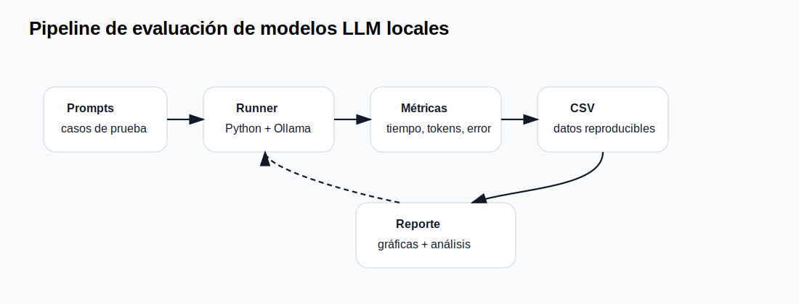

# Recursos, costos y benchmark de LLM

## 1. Por qué medir

En automatización y robótica, una respuesta correcta pero lenta puede ser inútil. Una respuesta rápida pero inestable puede ser peligrosa. Por eso, el uso de LLM debe evaluarse con métricas explícitas.

Las métricas mínimas del curso son:

- Tiempo total de respuesta.
- Tokens de entrada y salida.
- Éxito de formato JSON.
- Éxito semántico de la instrucción.
- Uso de CPU, GPU y memoria.
- Costo estimado por 1,000 instrucciones.
- Robustez ante instrucciones ambiguas.

{: .diagram }

## 2. CPU vs GPU

La inferencia en CPU puede ser suficiente para modelos pequeños, pero suele tener latencia alta. La GPU acelera operaciones matriciales, pero está limitada por VRAM. En un laboratorio académico, la pregunta no es sólo “¿qué corre?”, sino “¿qué corre con latencia aceptable para la aplicación?”.

Variables críticas:

- Tamaño del modelo.
- Cuantización.
- Longitud del contexto.
- Tokens de salida.
- Capacidad de VRAM.
- Temperatura y política de muestreo.

## 3. Memoria y cuantización

Un modelo de 8B parámetros en precisión completa requiere mucha memoria. La cuantización reduce el tamaño de los pesos mediante representaciones de menor precisión. En práctica, formatos como Q4 permiten ejecutar modelos en hardware más accesible, con posible pérdida de calidad.

No se debe reportar sólo “funcionó”. Un reporte académico debe indicar:

```text
Modelo: llama3.1:8b-instruct-q4_K_M
Hardware: CPU/GPU, VRAM, RAM
Prompt tokens: N
Output tokens: N
Tiempo promedio: X s
Desviación estándar: X s
% JSON válido: X%
```

## 4. Código base de benchmark

Ver archivo:

```text
codigo/01_benchmark_ollama/benchmark_ollama.py
```

Uso:

```bash
cd codigo/01_benchmark_ollama
pip install -r requirements.txt
python benchmark_ollama.py --model llama3.1:8b --runs 20 --prompt "Devuelve JSON para ir al centro"
```

El script genera un CSV con resultados. La práctica exige graficar esos datos y discutir las causas de variación.

## 5. Costo de API

Para APIs comerciales, el costo se calcula por tokens. Fórmula general:

```text
costo = (tokens_entrada / 1e6) * precio_entrada + (tokens_salida / 1e6) * precio_salida
```

Ejemplo:

```text
100,000 instrucciones al mes
400 tokens de entrada por instrucción
120 tokens de salida por instrucción
```

El costo real depende del proveedor, modelo, cache, herramientas, búsqueda web o modalidad de audio/imagen. Por eso las páginas de precios se deben consultar antes de cada proyecto.

## 6. Actividad en clase

Cada equipo ejecutará el mismo conjunto de 10 prompts en dos modelos y comparará:

- Latencia promedio.
- Variabilidad.
- Calidad de JSON.
- Errores de interpretación.
- Recomendación final para el proyecto.

{: .evidencia }
> El reporte debe incluir CSV, gráfica, tabla comparativa, interpretación técnica y conclusión de adopción.

## 7. Fuentes

- Kaplan et al. *Scaling Laws for Neural Language Models*. <https://arxiv.org/abs/2001.08361>
- Ollama API. <https://docs.ollama.com/api/introduction>
- OpenAI pricing. <https://openai.com/api/pricing/>
- Gemini pricing. <https://ai.google.dev/gemini-api/docs/pricing>
- Anthropic pricing. <https://www.anthropic.com/pricing>
