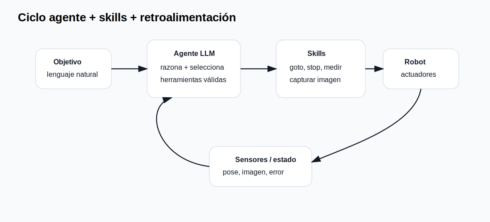

# Agentes, skills y automatización de tareas

## 1. Qué es un agente LLM

Un agente LLM es un sistema donde el modelo no sólo responde texto, sino que decide usar herramientas, consultar memoria, ejecutar funciones, observar resultados y continuar. En robótica, esto puede convertirse en un ciclo de alto nivel:

```text
objetivo → razonar → elegir skill → ejecutar → observar → ajustar plan
```

{: .diagram }

## 2. ReAct

ReAct propuso intercalar razonamiento y acciones. La contribución importante para el curso es que un agente puede alternar entre pensar sobre la tarea y actuar sobre el entorno mediante herramientas.

## 3. Skills

Una skill es una acción disponible para el agente. Para que sea segura debe tener:

- Nombre.
- Descripción.
- Parámetros.
- Restricciones.
- Resultado esperado.
- Fallas posibles.

Ejemplo:

```json
{
  "name": "goto",
  "description": "Mover el robot a una coordenada segura del plano",
  "parameters": {"x":"float", "y":"float", "duration_s":"float"},
  "limits": {"x":[-500,500], "y":[-300,300], "duration_s":[1,120]}
}
```

## 4. Agente mínimo en Python

Ver:

```text
codigo/04_agente_skills/agent.py
```

El agente no ejecuta código arbitrario. Sólo puede llamar funciones registradas.

## 5. Diseño de agente para robótica

Componentes:

1. **LLM:** interpreta objetivo.
2. **Lista de skills:** acciones permitidas.
3. **Validador:** revisa parámetros.
4. **Executor:** llama la función real.
5. **Observer:** devuelve estado.
6. **Logger:** registra decisiones.

## 6. Ejercicio

Crear tres skills: `goto`, `stop`, `get_state`. El agente debe resolver una instrucción compuesta:

```text
Ve al centro, espera estado, luego detente.
```

{: .evidencia }
> Entregar código, bitácora del ciclo agente, JSON de cada acción y reflexión sobre límites de seguridad.

## 7. Fuentes

- Yao et al. *ReAct: Synergizing Reasoning and Acting in Language Models*. <https://arxiv.org/abs/2210.03629>
- Google Research ReAct blog. <https://research.google/blog/react-synergizing-reasoning-and-acting-in-language-models/>
- Gemini function calling. <https://ai.google.dev/gemini-api/docs/function-calling>
- Claude tool use. <https://docs.anthropic.com/en/docs/agents-and-tools/tool-use/overview>
