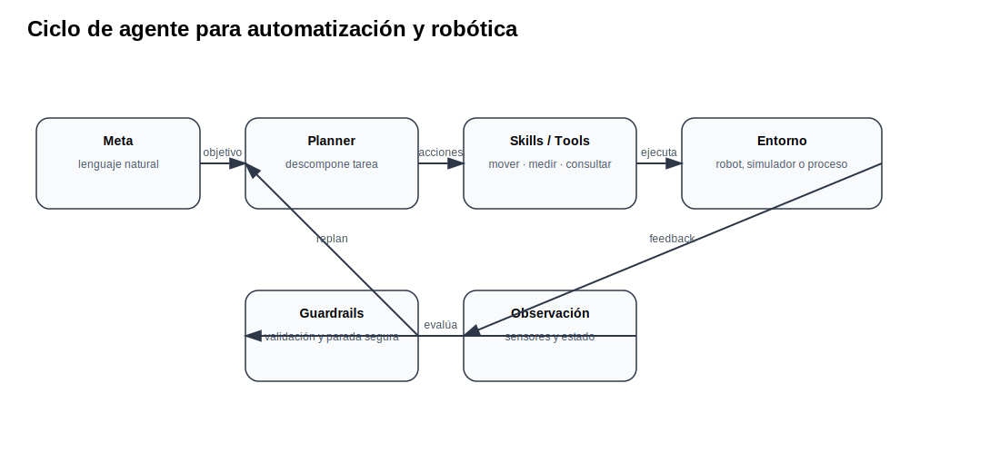

# 09 Agentes, skills, memoria, tools y guardrails

<strong>Objetivo:</strong> Distinguir chatbot, workflow y agente; diseñar skills y guardrails para tareas automatizadas.

## Ideas centrales para la clase

Un chatbot responde; un agente decide pasos y usa herramientas. En automatización y robótica, un agente debe tener skills acotadas, validadores, bitácora de acciones y condiciones de parada segura.

ReAct integra razonamiento y acción; Toolformer estudia el uso de herramientas por modelos de lenguaje; frameworks como LangGraph ayudan a modelar flujos con estado, herramientas y decisiones.

## Arquitectura de agente

## Demo sugerida

Usar `assets/code/agent_skills.py` para separar skills de ejecución, estado y bitácora.

## Checklist mínimo de evidencia

- [ ] Conceptos principales explicados con tus propias palabras.
- [ ] Diagrama o tabla técnica del tema.
- [ ] Evidencia de demo, práctica o prueba.
- [ ] Resultado medible cuando aplique: latencia, costo, tokens, éxito/falla o errores.
- [ ] Reflexión: ¿qué implicación tiene esto para automatización o robótica?
- [ ] Fuentes consultadas y citadas.

## Fuentes citadas

- [react](https://arxiv.org/abs/2210.03629)
- [toolformer](https://arxiv.org/abs/2302.04761)
- [langchain_agents](https://docs.langchain.com/oss/python/langchain/agents)
- [langgraph](https://docs.langchain.com/oss/python/langgraph/workflows-agents)
- [openai_functions](https://developers.openai.com/api/docs/guides/function-calling)
