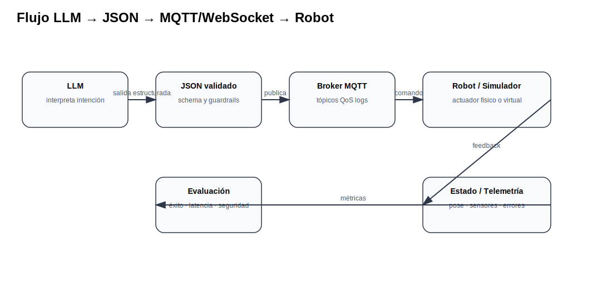

# 05 Ollama como API, MQTT, WebSocket y embebidos

<strong>Objetivo:</strong> Integrar un LLM local con sistemas de automatización mediante APIs, MQTT y WebSocket.

## Ideas centrales para la clase

Ollama permite exponer modelos locales mediante una API HTTP. A partir de ahí el LLM puede integrarse con un backend que traduzca lenguaje natural a mensajes para otros sistemas.

MQTT es útil en IoT y automatización por su patrón publish/subscribe, ligereza y separación entre productores y consumidores. WebSocket es útil para comunicación bidireccional en tiempo real entre navegador y servidor.

## Arquitectura

## Demo sugerida

- `assets/code/mqtt_publish_subscribe.py`
- `assets/code/llm_to_mqtt_robot.py`

## Checklist mínimo de evidencia

- [ ] Conceptos principales explicados con tus propias palabras.
- [ ] Diagrama o tabla técnica del tema.
- [ ] Evidencia de demo, práctica o prueba.
- [ ] Resultado medible cuando aplique: latencia, costo, tokens, éxito/falla o errores.
- [ ] Reflexión: ¿qué implicación tiene esto para automatización o robótica?
- [ ] Fuentes consultadas y citadas.

## Fuentes citadas

- [ollama_api_ref](https://ollama.readthedocs.io/en/api/)
- [mqtt_oasis](https://www.oasis-open.org/standard/mqtt-v5-0-os/)
- [mqtt_spec](https://docs.oasis-open.org/mqtt/mqtt/v5.0/mqtt-v5.0.html)
- [mdn_ws](https://developer.mozilla.org/en-US/docs/Web/API/WebSockets_API)
