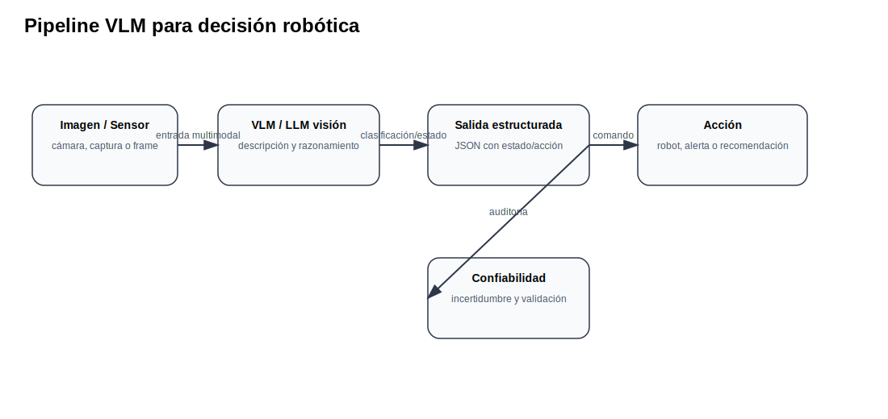

# 08 Modelos con visión y robótica

<strong>Objetivo:</strong> Explorar modelos multimodales y modelos visión-lenguaje-acción para percepción, razonamiento visual y decisión robótica.

## Ideas centrales para la clase

Los modelos VLM y VLA conectan lenguaje, percepción y acción. En robótica, esta integración permite que una instrucción textual se relacione con objetos, escenas y acciones físicas. Sin embargo, estos modelos tienen límites: alucinación visual, incertidumbre, baja garantía de seguridad y dificultad para generalizar a entornos no vistos.

RT-2 estudia cómo incorporar modelos visión-lenguaje entrenados con datos web en control robótico. PaLM-E explora modelos multimodales encarnados. SayCan propone conectar instrucciones de lenguaje con habilidades robóticas y funciones de valor/affordance.

## Pipeline

## Actividad

Convertir una imagen o estado visual en una salida JSON con campos: `estado`, `confianza`, `accion_sugerida`, `riesgo`, `requiere_humano`.

## Checklist mínimo de evidencia

- [ ] Conceptos principales explicados con tus propias palabras.
- [ ] Diagrama o tabla técnica del tema.
- [ ] Evidencia de demo, práctica o prueba.
- [ ] Resultado medible cuando aplique: latencia, costo, tokens, éxito/falla o errores.
- [ ] Reflexión: ¿qué implicación tiene esto para automatización o robótica?
- [ ] Fuentes consultadas y citadas.

## Fuentes citadas

- [rt2](https://deepmind.google/blog/rt-2-new-model-translates-vision-and-language-into-action/)
- [rt2_arxiv](https://arxiv.org/abs/2307.15818)
- [palme](https://arxiv.org/abs/2303.03378)
- [saycan](https://say-can.github.io/)
